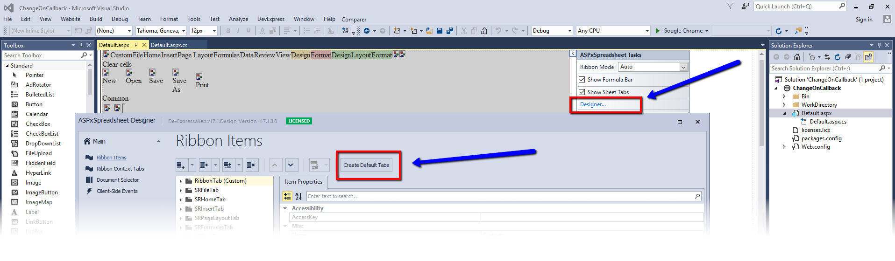

<!-- default badges list -->

[](https://supportcenter.devexpress.com/ticket/details/T622138)
[](https://docs.devexpress.com/GeneralInformation/403183)
<!-- default badges end -->
# Spreadsheet for ASP.NET Web Forms - How to add a custom ribbon button and modify an active worksheet on its click
<!-- run online -->
**[[Run Online]](https://codecentral.devexpress.com/t622138/)**
<!-- run online end -->

This example demonstrates how to add some values to spreadsheet cells and clear them when a custom button is clicked. 

## Implementation Details

1. Invoke the [ASPxSpreadsheet](https://docs.devexpress.com/AspNet/DevExpress.Web.ASPxSpreadsheet.ASPxSpreadsheet) designer and click the **Create Default Tabs** button. The designer creates default ribbon items in your markup.
  


2. Add a custom tab, group and implement your own [RibbonTemplateItem](https://docs.devexpress.com/AspNet/DevExpress.Web.RibbonTemplateItem) with a button. In the button [Click](https://docs.devexpress.com/AspNet/js-ASPxClientButton.Click) event handler, call the [ASPxClientSpreadsheet.PerformCallback](https://docs.devexpress.com/AspNet/js-ASPxClientSpreadsheet.PerformCallback(parameter)) method to initiate a server request.

```aspx
<dx:ASPxSpreadsheet ID="ASPxSpreadsheet1" OnCallback="ASPxSpreadsheet1_Callback" ClientInstanceName="spreadSheet" runat="server" WorkDirectory="~/WorkDirectory">
    <RibbonTabs>
        <dx:RibbonTab Name="Custom" Text="Custom">
            <Groups >
                <dx:RibbonGroup Name="CustomGroup" Text="CustomGroup">                            
                    <Items>                                
                        <dx:RibbonTemplateItem >                                                                                               
                            <Template>                                       
                                <dx:ASPxButton runat="server" ID="btn1"  RenderMode="Link" Text="Send a callback" AutoPostBack="false">
                                    <ClientSideEvents Click="function(s,e){ spreadSheet.PerformCallback('custom'); }" />                                         
                                </dx:ASPxButton>                                            
                            </Template>
                        </dx:RibbonTemplateItem> 
                    </Items>                           
                </dx:RibbonGroup>
            </Groups>
           </dx:RibbonTab>
	    <dx:SRFileTab> 
			<Groups>		
				<dx:SRFileCommonGroup>		
					<Items>		
						<dx:RibbonTemplateItem>		
							<Template>		
								<dx:ASPxButton runat="server" ID="btn2"  RenderMode="Link" Text="Clear cells" AutoPostBack="false">		
									<ClientSideEvents Click="function(s,e){ spreadSheet.PerformCallback('clear'); }" />		
								</dx:ASPxButton>		
							</Template>		
						</dx:RibbonTemplateItem>		
						<dx:SRFileNewCommand>		
						</dx:SRFileNewCommand>		
						...
					</Items>
				</dx:SRFileCommonGroup>
			</Groups>
	    </dx:SRFileTab>		
		....
	</RibbonTabs>
</ASPxSpreadsheet>
```


3. Modify document in the [ASPxSpreadsheet.Callback](https://docs.devexpress.com/AspNet/DevExpress.Web.ASPxSpreadsheet.ASPxSpreadsheet.Callback) event handler.


```cs
protected void ASPxSpreadsheet1_Callback(object sender, DevExpress.Web.CallbackEventArgsBase e) {
    ASPxSpreadsheet ss = sender as ASPxSpreadsheet;
    Worksheet worksheet = ss.Document.Worksheets.ActiveWorksheet;
    if(e.Parameter == "custom") {
        PrepareTitleRange(worksheet);
        PrepareHeaderCells(worksheet);
        InitializeDataCellsValues(worksheet);
    }
    if(e.Parameter == "clear") {
        worksheet.Clear(worksheet.GetUsedRange());
    }
}
```

## Files to Review

* [Default.aspx](./CS/Default.aspx) (VB: [Default.aspx](./VB/Default.aspx))
* [Default.aspx.cs](./CS/Default.aspx.cs) (VB: [Default.aspx.vb](./VB/Default.aspx.vb))


